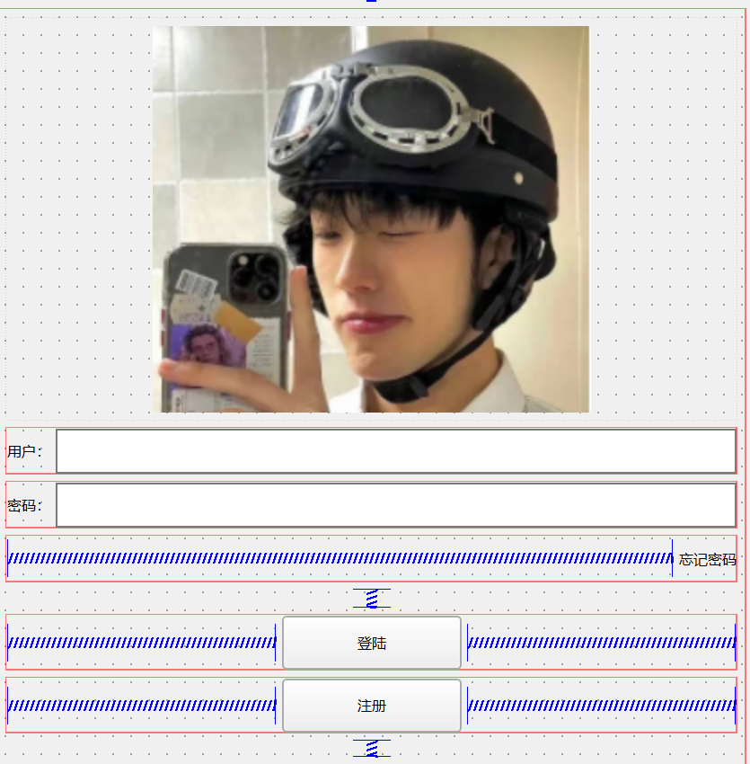
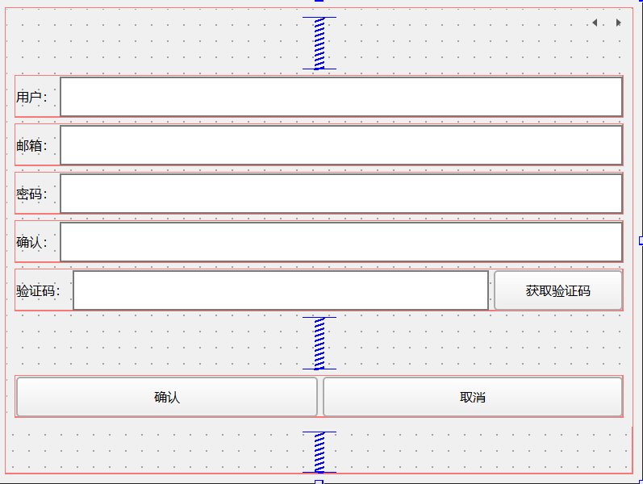
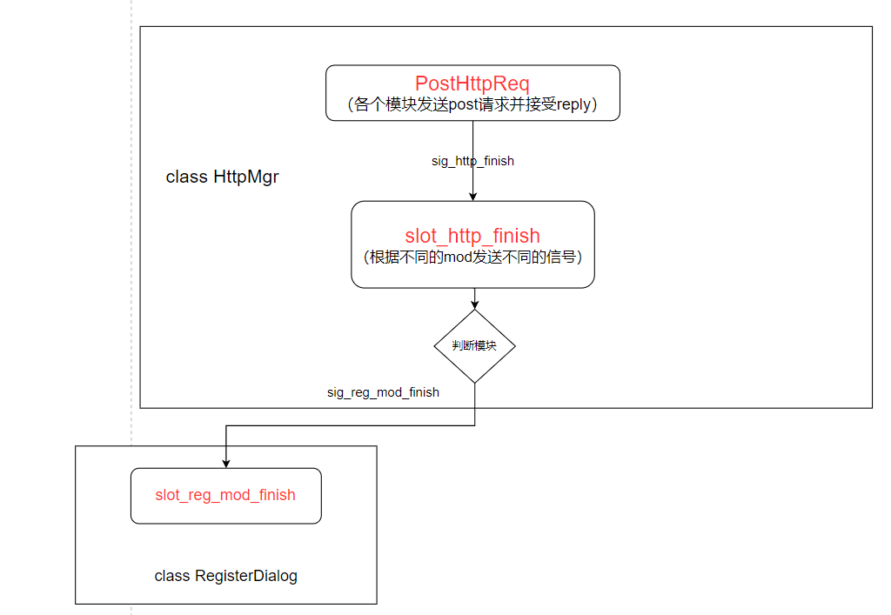

# chatxt

##  简介

本项目为一款C++全栈聊天项目，此项目包括PC端QT界面编程，asio异步服务器设计，beast网络库搭建http网关，nodejs搭建验证服务，各服务间用grpc通信，server和client用asio通信等，也包括用户信息的录入等。

## 登陆和注册界面

### 登陆界面

logindialog.ui负责登陆界面，下图为登陆页面



### 注册界面

registerdialog.ui负责注册页面，如下图



在注册类的构造函数里添加lineEdit的模式为密码模式

```C++
ui->passwd_edit->setEchoMode(QLineEdit::Password);
ui->confirm_edit->setEchoMode(QLineEdit::Password);
```

在注册界面添加一个widget，用来提示输入错误信息

在qss里设置err_tip样式，根据不同的状态做不同颜色提示

```c++
#err_tip[state='normal']{
   color: green;
}
#err_tip[state='err']{
   color: red;
}
```

在项目中添加global.h和global.cpp文件，用来声明全局函数和变量

```c
/*global.h*/
#ifndef GLOBAL_H
#define GLOBAL_H
#include <QWidget>
#include <functional>
#include <QStyle>

// 刷新qss
extern std::function<void(QWidget*)> repolish;

#endif // GLOBAL_H


/*global.cpp*/
#include "global.h"

std::function<void(QWidget*)> repolish = [](QWidget* w){
    w->style()->unpolish(w);
    w->style()->polish(w);
};
```

在Register的构造函数中添加样式设置

```c++
ui->err_tip->setProperty("state","normal");
repolish(ui->err_tip);
```

获取验证码的逻辑，ui关联获取验证码按钮的槽事件，实现槽函数

```c

void RegisterDialog::on_vafify_ptn_clicked()
{
    //验证邮箱的地址正则表达式
    auto email = ui->emai_edit->text();
    // 邮箱地址的正则表达式
    QRegularExpression regex(R"((\w+)(\.|_)?(\w*)@(\w+)(\.(\w+))+)");
    bool match = regex.match(email).hasMatch(); // 执行正则表达式匹配
    if(match){
        //发送http请求获取验证码
    }else{
        //提示邮箱不正确
        showTip(tr("邮箱地址不正确"), match);
    }
}
```

在RegisterDialog中添加showTip函数

```c
void RegisterDialog::showTip(QString str, bool b_ok)
{
    if(b_ok){
        ui->err_tip->setProperty("state", "normal");
    }
    else{
        ui->err_tip->setProperty("state","err");
    }
    ui->err_tip->setText(str);
    repolish(ui->err_tip);
}
```


### 登陆跳转到注册页面

在LoginDialog类中声明里==添加信号切换注册界面==

```c++
signals:
    void switchRegister();
```

在LoginDialog的构造函数中连接按钮点击事件

```C++
connect(ui->reg_btn, &QPushButton::clicked, this, &LoginDialog::switchRegister);
```

 按钮点击后，LoginDialog发出switchRegister信号，该信号发送给MainWindow用来切换界面

```c
// mainwindow.h的MainWindow的类中声明槽函数

public slots:
    void SlotSwitchReg();
private:
	RegisterDialog* m_reg_dlg;

// mainwindow.cpp 在其构造函数中添加注册类对象的初始化以及连接switchRegister信号
//创建和注册消息的链接
connect(m_login_dlg, &LoginDialog::switchRegister, this, &MainWindow::SlotSwitchReg);
m_reg_dlg = new RegisterDialog();
```

实现槽函数

```c
void MainWindow::SlotSwitchReg()
{
    setCentralWidget(m_reg_dlg);	// 设置注册界面为主窗口	
    m_login_dlg->hide();			// 隐藏登陆界面

    m_reg_dlg->show();				// 显示注册界面
}
```

## 客户端HTTP管理类

### 单例类

```c++
#include <mutex>
#include <memory>
#include <iostream>

template<class T>
class Singleton
{
protected:
    Singleton() = default;
    Singleton(const Singleton&) = delete;
    Singleton& operate(const Singleton&) = delete;
    static std::shared_ptr<T> _instance;
public:
    static std::shared_ptr<T> GetInstance()
    {
        static std::once_flag s_flag;

        std::call_once(s_flag, [&](){
            _instance = std::shared_ptr<T>(new T);
        });

        return _instance;
    }

    void PrintAddress() {
        std::cout << _instance.get() << std::endl;
    }

    ~Singleton() {
        std::cout << "this is singleton destruct" << std::endl;
    }
};
template<class T>
std::shared_ptr<T> Singleton<T>::_instance = nullptr;
```

### http管理类

```c++
#include <QObject>
#include <QString>
#include <QUrl>
#include <QtNetwork/QNetworkAccessManager>
#include <QtNetwork/QNetworkReply>
#include <QJsonDocument>
#include <QJsonObject>
#include "Singleton.h"
#include "global.h"

class HttpMgr : public QObject, public Singleton<HttpMgr>, public std::enable_shared_from_this<HttpMgr>
{
    Q_OBJECT
public:
    ~HttpMgr();
private:
    friend class Singleton;
    HttpMgr();
    QNetworkAccessManager m_manager;
    void PostHttpReq(QUrl url, QJsonObject json, ReqId req_id, Modules mod); // 发送Http的post请求

private slots:
    void slot_http_finish(ReqId id, QString res, ErrorCodes err, Modules mod);

signals:
    void sig_http_finish(ReqId id, QString res, ErrorCodes err, Modules mod); // 发送完http请求的信号
    void sig_reg_mod_finish(ReqId id, QString res, ErrorCodes err);
};

```

### 发送Post请求

```c++
void PostHttpReq(QUrl url, QJsonObject json, ReqId req_id, Modules mod);
作用: 发送http的post请求
参数:
    url: 发送请求用到的url;
    json: 请求的数据;
	req_id: 请求id;
	mod: 哪个模块发出的请求mod
```

在global.h中定义ReqId和ErrorCodes、Modules

```c
enum ReqId{
    ID_GET_VARIFY_CODE = 1001, //获取验证码
    ID_REG_USER = 1002, //注册用户
};

enum ErrorCodes{
    SUCCESS = 0,
    ERR_JSON = 1, //Json解析失败
    ERR_NETWORK = 2,
};

enum Modules{
    REGISTERMOD = 0,
};
```

定义信号，当发送post请求并接收reply后，执行信号连接的槽函数

```c
void sig_http_finish(ReqId id, QString res, ErrorCodes err, Modules mod); // 发送完http请求的信号
```

定义槽函数，与上面的信号连接

```C++
void slot_http_finish(ReqId id, QString res, ErrorCodes err, Modules mod);
```

* 实现PostHttpReq

```C++
void HttpMgr::PostHttpReq(QUrl url, QJsonObject json, ReqId req_id, Modules mod)
{
    // 创建一个HTTP Post请求，并设置请求头和请求体
    QByteArray data = QJsonDocument(json).toJson();
    // 通过url构造请求
    QNetworkRequest request(url);
    request.setHeader(QNetworkRequest::ContentTypeHeader, "application/json");
    request.setHeader(QNetworkRequest::ContentLengthHeader, QByteArray::number(data.length()));
    // 发送请求，并处理响应，获取自己的智能指针，构造伪闭包增加智能指针引用计数
    auto self = shared_from_this();
    QNetworkReply* reply = m_manager.post(request, data);
    // 设置信号和槽等待发送完成
    QObject::connect(reply, &QNetworkReply::finished, [reply, self, req_id, mod](){
        //处理错误的情况
        if(reply->error() != QNetworkReply::NoError){
            qDebug() << reply->errorString();
            //发送信号通知完成
            emit self->sig_http_finish(req_id, "", ErrorCodes::ERR_NETWORK, mod);
            reply->deleteLater();
            return;
        }
        //无错误则读回请求
        QString res = reply->readAll();
        //发送信号通知完成
        emit self->sig_http_finish(req_id, res, ErrorCodes::SUCCESS,mod);
        reply->deleteLater();
        return;
    });

}
```

* 实现slot_http_finish

```c++
void HttpMgr::slot_http_finish(ReqId id, QString res, ErrorCodes err, Modules mod)
{
    if(mod == Modules::REGISTERMOD)
    {
        // 发送信号通知指定模块的http的响应结束了
        emit sig_reg_mod_finish(id, res, err);
    }
    
    ......
}
```

添加信号sig_reg_mod_finish

```c++
signals:
    void sig_reg_mod_finish(ReqId id, QString res, ErrorCodes err);
```

在注册界面连接sig_reg_mod_finish信号

```c++
RegisterDialog::RegisterDialog(QWidget *parent)
    : QDialog(parent)
    , ui(new Ui::RegisterDialog)
{
    //省略...
	connect(HttpMgr::GetInstance().get(), &HttpMgr::sig_reg_mod_finish,
            this, &RegisterDialog::slot_reg_mod_finish);
}
```

* 实现slot_reg_mod_finish函数

```c++
void RegisterDialog::slot_reg_mod_finish(ReqId id, QString res, ErrorCodes err)
{
    if(err != ErrorCodes::SUCCESS)
    {
        showTip(tr("网络请求错误"), false);
        return;
    }
    //解析JSon字符串 res转化为QByteArray
    QJsonDocument jsonDoc = QJsonDocument::fromJson(res.toUtf8());
    if(jsonDoc.isNull() || !jsonDoc.isObject())
    {
        showTip(tr("json解析失败"), false);
        return;
    }

    // 将json文档转化为json对象  jsonDoc.object()

    m_handlers[id](jsonDoc.object());

    return;

}
```

### 注册消息处理

需要对RegisterDialog**注册消息处理**，头文件声明

```c++
QMap<ReqId, std::function<void(const QJsonObject&)>> m_handlers;
```

在RegisterDialog中添加注册消息处理的声明和定义

```c++
void RegisterDialog::initHttpHandlers()
{
    m_handlers.insert(ReqId::ID_GET_VARIFY_CODE, [this](const QJsonObject& JsonObj){
        int error = JsonObj["error"].toInt();
        if(error != ErrorCodes::SUCCESS){
            showTip(tr("参数错误"), false);
            return;
        }

        auto email = JsonObj["email"].toString();
        showTip(tr("验证码已经发送到邮箱"), true);
        qDebug() << "email is " << email;
    });
}
```

### 流程图


